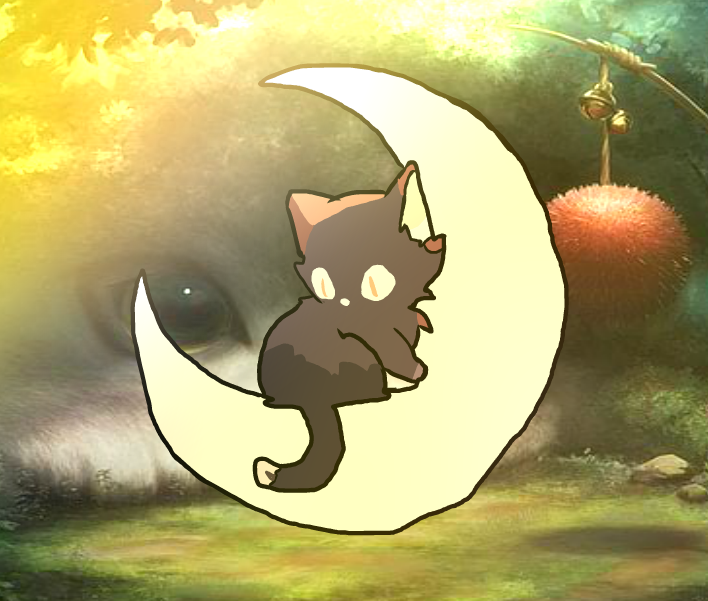
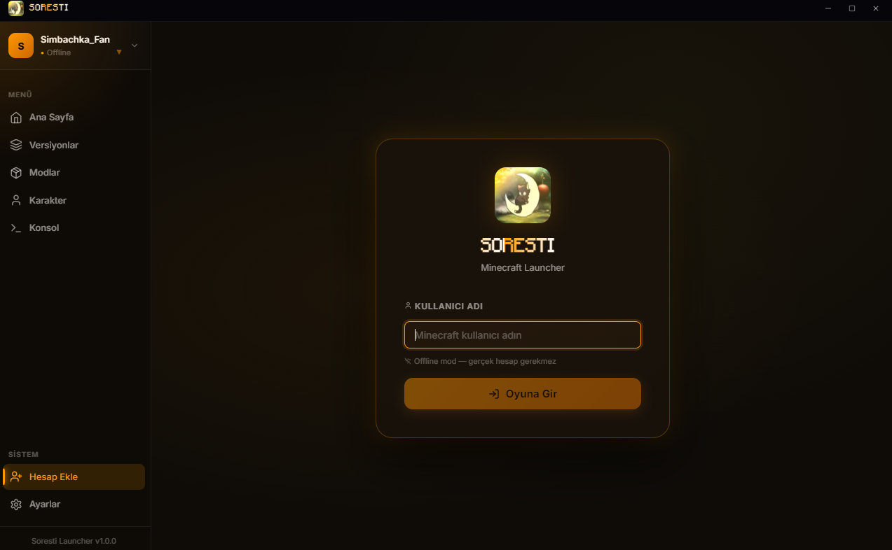
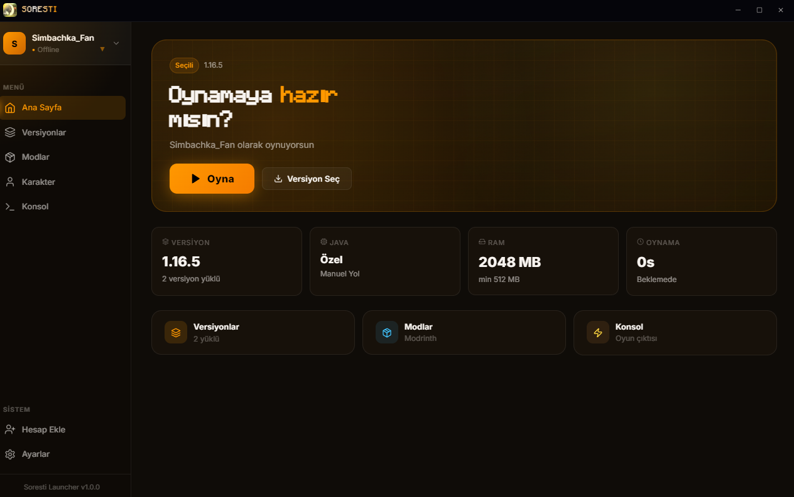
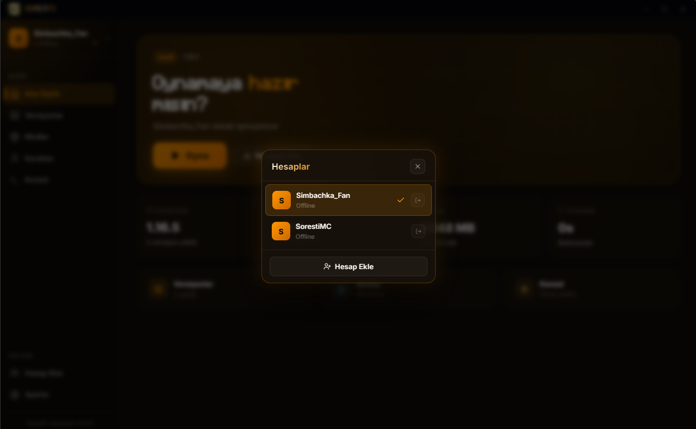
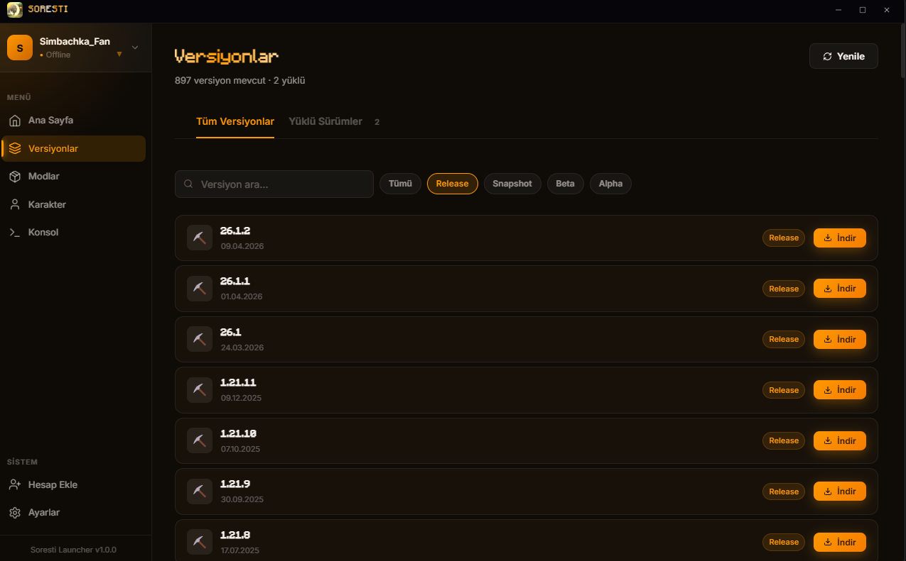

<div align="center">

<br/>



# ⚡ Soresti Launcher

**Modern, blazing-fast Minecraft launcher with multi-account support, 3D skin preview, and an elegant UI**

<br/>

[](https://github.com/anilmisayten-cmyk/SorestiLauncher/releases)
[](https://github.com/anilmisayten-cmyk/SorestiLauncher/blob/main/LICENSE)
[](#)
[](#)

<br/>

[Features](#-features) • [Preview](#-preview) • [Screenshots](#-screenshots) • [Download](#-download) • [Build](#-building-from-source) • [Roadmap](#-roadmap)

<br/>

</div>

---

## 🎥 Preview

<div align="center">
  
  <br/>
  <sub><i>Watch the launcher in action — smooth animations, account switching, version selection, and more.</i></sub>
</div>

---

## ✨ Features

### 🚀 Blazing-Fast Downloads
Say goodbye to the dreaded 10% stall. Soresti uses **256-parallel asset downloads** with **BMCLAPI mirrors** as primary sources, **1024 max sockets**, and aggressive timeouts. Downloads saturate your full bandwidth just like the biggest launchers.

### 👥 Multi-Account Management
Seamlessly **add, switch, and remove** multiple Minecraft accounts. The account switcher lets you jump between profiles in seconds — perfect for players with alts or multiple servers.

### 🎨 Custom-Branded Experience
- **Animated gradient text** on titles and headers
- **Minecraft-style font** (minecraft.otf) throughout the UI
- **Custom intro video** on startup (skippable via click or Escape)
- **Modern glass-morphism design** with smooth Framer Motion transitions

### 🖼️ 3D Skin Preview
See your Minecraft skin come to life with **interactive 3D rendering**. Rotate, zoom, and inspect your character model right inside the launcher.

### 📦 All-in-One Installer
Clean **NSIS installer** with desktop shortcut, start menu entry, and proper uninstall support. No bloat, no extra toolbars — just your launcher.

### ⚙️ Full Version Support
Automatically fetches and installs **every Minecraft version from 1.16.5 to the latest snapshots**. Client JARs, libraries, and assets are handled automatically.

### 🧩 Mod Loader Integration
Built-in support for **Forge, Fabric, and Quilt**. The mods page lets you browse and install mod loaders directly — no manual download needed.

### 💻 Real-Time Console
Live game output console shows you what's happening under the hood. Perfect for debugging mod issues or just watching the game start up.

### 🎬 Video Splash Screen
Professional intro video plays on launch. The splash window auto-closes and transitions to the main app seamlessly.

---

## 🖼️ Screenshots

<div align="center">
  <table>
    <tr>
      <td align="center"></td>
      <td align="center"></td>
    </tr>
    <tr>
      <td align="center"><b>Login Screen</b></td>
      <td align="center"><b>Home Page</b></td>
    </tr>
    <tr>
      <td align="center"></td>
      <td align="center"></td>
    </tr>
    <tr>
      <td align="center"><b>Account Switcher</b></td>
      <td align="center"><b>Version Selector</b></td>
    </tr>
  </table>
</div>

---

## 📥 Download

<div align="center">

### Get Soresti Launcher

| Version | Platform | Link |
|---------|----------|------|
| **Latest** | Windows x64 | [⬇️ Download Installer](https://github.com/anilmisayten-cmyk/SorestiLauncher/releases/latest) |

</div>

<details>
<summary><b>📋 System Requirements</b></summary>

| Requirement | Minimum | Recommended |
|-------------|---------|-------------|
| **OS** | Windows 10 (x64) | Windows 11 (x64) |
| **RAM** | 4 GB | 8 GB+ |
| **Storage** | 500 MB free | 5 GB+ (for Minecraft) |
| **Java** | Java 17 (auto-detected) | Java 21 |
| **Internet** | 10 Mbps | 50 Mbps+ |

</details>

---

## 🚦 Quick Start

1. **Download** the latest installer from [Releases](https://github.com/anilmisayten-cmyk/SorestiLauncher/releases)
2. **Run** the installer and follow the setup wizard
3. **Launch** Soresti Launcher from your desktop
4. **Log in** with your Microsoft or Mojang account
5. **Play** — select a version and hit play!

---

## 🔧 Building from Source

### Prerequisites

| Tool | Version |
|------|---------|
| [Node.js](https://nodejs.org/) | 18+ |
| [npm](https://www.npmjs.com/) | 9+ |

### Build & Package

```bash
# Clone the repository
git clone https://github.com/anilmisayten-cmyk/SorestiLauncher.git
cd SorestiLauncher

# Install dependencies
npm install

# Build all modules (renderer, main, preload)
npm run build

# Package as Windows installer (output in release/)
npm run dist
```

### Development Mode (Hot Reload)

```bash
npm run dev
```

This starts the webpack dev servers for the renderer, main, and preload processes with file watching. Run `npm run start` or `npm run electron` in another terminal to launch the app.

---

## 🛠️ Tech Stack

<div align="center">

| 🏗️ Layer | Technology | Purpose |
|-----------|------------|---------|
| **Framework** | [Electron](https://www.electronjs.org/) | Cross-platform desktop shell |
| **UI** | [React 18](https://react.dev/) + [TypeScript](https://www.typescriptlang.org/) | Component-based user interface |
| **Bundler** | [Webpack 5](https://webpack.js.org/) | Module bundling & HMR |
| **State** | [Zustand](https://github.com/pmndrs/zustand) | Lightweight state management |
| **Animations** | [Framer Motion](https://www.framer.com/motion/) | Smooth UI transitions |
| **Icons** | [Lucide React](https://lucide.dev/) | Clean, crisp SVG icons |
| **HTTP** | [Axios](https://axios-http.com/) | Download client & API calls |
| **3D** | [skinview3d](https://github.com/bs-community/skinview3d) | Minecraft skin rendering |
| **Archives** | [adm-zip](https://github.com/cthackers/adm-zip) | ZIP extraction for mods |
| **Installer** | [electron-builder](https://www.electron.build/) + NSIS | Windows installer packaging |
| **Font** | [Minecraft Font](https://fontspace.com) | Authentic MC typography |
| **Auth** | Microsoft OAuth / Mojang API | Account authentication |

</div>

---

## 🗺️ Roadmap

- [x] **Core launcher** — version download, game launch, basic UI
- [x] **Multi-account support** — add, switch, manage accounts
- [x] **Custom branding** — fonts, animations, splash video
- [x] **Fast downloads** — 256-parallel assets, BMCLAPI mirrors
- [ ] **Code signing** — SmartScreen bypass (SignPath Foundation)
- [ ] **Mod management** — auto-download Forge/Fabric/Quilt
- [ ] **Skin changer** — apply skins directly from the launcher
- [ ] **Auto-update** — automatic launcher updates
- [ ] **Linux support** — native Linux builds

---

## 🤝 Contributing

Contributions are welcome! If you have ideas, suggestions, or bug reports:

1. **Fork** the repository
2. **Create** a feature branch: `git checkout -b feature/my-feature`
3. **Commit** your changes: `git commit -m "feat: add my feature"`
4. **Push** to the branch: `git push origin feature/my-feature`
5. **Open a Pull Request** — we'll review it ASAP!

---

## 📄 License

This project is **open source** under the [MIT License](LICENSE).  
You are free to use, modify, and distribute it as you wish.

---

<div align="center">
  <br/>
  
  <br/><br/>
  <sub>Built with ❤️ by the Soresti Team</sub>
  <br/>
  <sub>
    <a href="https://github.com/anilmisayten-cmyk/SorestiLauncher">GitHub</a> •
    <a href="https://github.com/anilmisayten-cmyk/SorestiLauncher/releases">Releases</a> •
    <a href="https://github.com/anilmisayten-cmyk/SorestiLauncher/issues">Issues</a>
  </sub>
</div>
